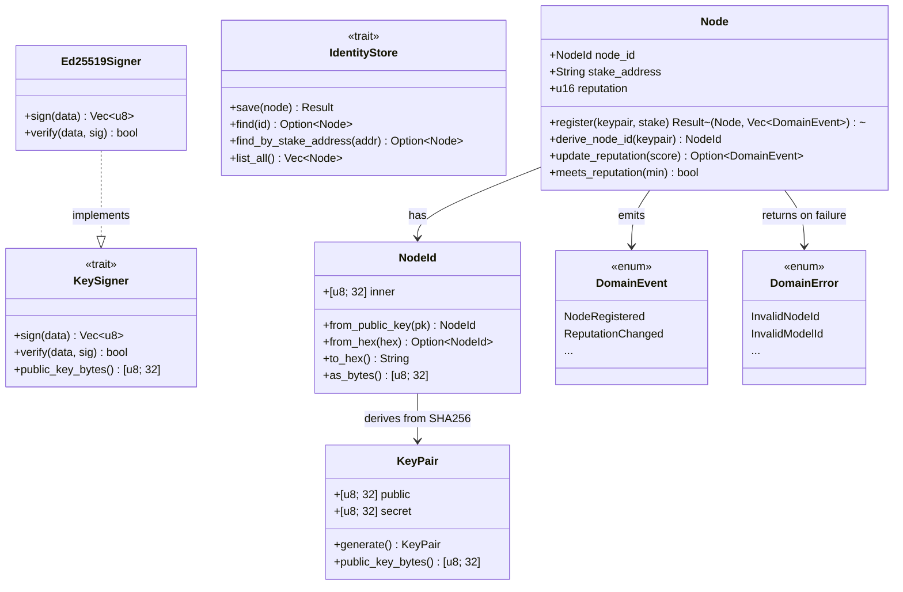

# Repository Guidelines

## Project Overview

Synapse is a **decentralized P2P inference protocol for Mixture-of-Experts (MoE) models**. It coordinates consumer GPUs into a distributed inference swarm — miners contribute idle hardware, clients consume frontier AI through an OpenAI-compatible API. No datacenter, no gatekeeper, no rate limits.

**Multi-language monorepo:** Rust core (P2P + gateway), Python vLLM runtime (subprocess), Solidity staking contracts (L2).

## Non-Negotiable Design Principles

**These are immutable. Every line of code in this repository MUST comply.**

### DDD (Domain-Driven Design)
- **Domain layer is PURE.** Zero I/O, zero framework deps, zero crypto, zero network. Domain types (value objects, entities, aggregates) are plain Rust structs/enums with no side effects. Exceptions: `sha2` for hash derivation is pure computation — allowed.
- **Application ports are traits.** `KeySigner`, `IdentityStore`, `InferenceEngine`, `StakeContract` — all I/O boundaries are defined as traits in domain modules. Domain NEVER imports infrastructure.
- **Infrastructure adapters implement traits.** `Ed25519Signer`, `DhtIdentityStore`, `VllmEngine` — each lives in an `infrastructure/` subdirectory and implements exactly one application port.
- **Aggregates enforce invariants.** `Node::register` validates stake address format. `Catalog::register` rejects duplicates. No aggregate can enter an invalid state.
- **Domain events for state changes.** Every aggregate mutation emits a `DomainEvent` variant. Infrastructure subscribes, domain doesn't care who listens.
- **Newtypes over primitives.** `NodeId([u8; 32])`, not `String`. `ModelId(String)` with validation. No naked primitives in domain signatures.

### Clean Architecture
- **Dependency rule: outer layers depend on inner, never reverse.** Domain → Application (ports) → Infrastructure (adapters) → Presentation (axum).
- **File-level module isolation.** Each domain concept gets its own file: `node_id.rs`, `key_pair.rs`, `node.rs`, `ports.rs`. No "everything in mod.rs" patterns.
- **Re-exports from module root.** `pub use node_id::NodeId;` in `identity/mod.rs` — consumers import from `crate::identity::NodeId`, never from nested paths.
- **Infrastructure NEVER leaks into domain.** `use ed25519_dalek` is ONLY allowed in `identity/infrastructure/`. A `use` of any external crypto/libp2p/axum crate in a domain file is a build failure.

### TDD (Test-Driven Development)
- **RED-GREEN-REFACTOR, always.** Write the failing test FIRST, run it to confirm it fails, then write minimum code to pass, then refactor.
- **Tests inline with source.** `#[cfg(test)] mod tests` at the bottom of every source file. No separate `tests/` directory for unit tests.
- **Test behavior, not implementation.** Assert on domain outcomes (events emitted, state transitions, error variants), not on internal method calls.
- **Every public function has at least one test.** Every `pub fn` in domain modules must have a corresponding `#[test]` that exercises it.
- **Test names describe the scenario.** `register_rejects_empty_stake_address`, not `test_register_2`.
- **No mocking in domain tests.** Domain tests are pure — construct inputs, call functions, assert outputs. Mocks are for infrastructure adapter tests only.

### Clean Code
- **Descriptive names.** `derive_node_id`, not `dni`. `reputation_below_threshold`, not `rep_chk`.
- **Small files.** One primary type per file. If a file exceeds ~250 lines, split it.
- **Doc comments on all public items.** `///` on every `pub struct`, `pub fn`, `pub trait`, `pub enum`. First line is a summary sentence.
- **No commented-out code.** Delete it. Git remembers.
- **No dead code.** `cargo clippy -- -D warnings` catches this. Zero warnings allowed.
- **thiserror for errors.** Never implement `Display` or `Error` by hand. Use `#[derive(Error)]`.
- **Conventional Commits.** `feat(scope): description`, `fix(scope): description`, `test(scope): description`.

## Domain Architecture

### Layered Clean Architecture (DDD)

Every module follows the same pattern: **pure domain** → **application ports** → **infrastructure adapters**.
Dependencies point inward only. Infrastructure never leaks into domain.

```mermaid
flowchart LR
    subgraph Presentation["Presentation (axum)"]
        Api["api.rs — HTTP routes"]
        Middleware["middleware.rs — auth, rate-limit"]
    end

    subgraph Infrastructure["Infrastructure"]
        Ed25519["identity/infrastructure/ed25519_signer.rs"]
        Dht["dht/kademlia.rs — libp2p DHT"]
        Runtime["synapse-runtime/ — vLLM subprocess"]
        Contract["contracts/stake/StakeManager.sol"]
    end

    subgraph Ports["Application Ports (Traits)"]
        KeySigner["KeySigner — sign/verify"]
        IdentityStore["IdentityStore — save/find Node"]
        Inference["InferenceEngine — generate()"]
        StakeContract["StakeContract — stake/slash"]
    end

    subgraph Domain["Pure Domain (zero I/O)"]
        Identity["identity/ — NodeId, KeyPair, Node"]
        Model["model/ — ModelId, ExpertId, Catalog"]
        Swarm["swarm/ — Consensus, DAG, Speculative"]
        Economic["economic/ — Reputation, Pricing"]
        Shared["shared/ — DomainError, DomainEvent"]
    end

    Presentation -->|"depends on"| Domain
    Presentation -->|"uses"| Ports
    Ports -->|"implemented by"| Infrastructure
    Infrastructure -->|"depends on"| Domain
    Domain --> Domain
```



### Identity Module (Phase 1, Issue #1)

The identity module is the foundational aggregate: `NodeId` derives from `KeyPair`, `Node` binds them with reputation.



### Two Swarm Modes

## Key Directories

```
synapse/
├── synapse-core/            # Rust — single crate, single binary
│   ├── src/
│   │   ├── main.rs          #   Binary entrypoint (axum + swarm + DHT)
│   │   ├── gateway/         #   axum HTTP: api, catalog, pricing, router, middleware
│   │   ├── identity/        #   NodeId, KeyPair, Node aggregate
│   │   ├── model/           #   ModelId, ExpertId, Catalog
│   │   ├── swarm/           #   Consensus, Speculative engine, DAG engine
│   │   ├── economic/        #   Reputation, Pricing, Stake management
│   │   ├── transport/       #   WebRTC, Signalling
│   │   └── dht/             #   Kademlia, Expert registry, Bootstrap
│   └── proto/               #   Protobuf schemas (8 message types)
├── synapse-runtime/         # Python — vLLM adapter (subprocess)
│   └── synapse_runtime/     #   Package source
├── contracts/stake/         # Solidity — StakeManager + Hardhat
│   ├── src/                 #   StakeManager.sol
│   └── test/                #   Hardhat tests
├── config/
│   ├── models.toml          #   Curated catalog (Kimi K3, Mixtral, etc.)
│   └── default.toml         #   Node defaults (VRAM, pricing, STUN)
├── features/                #   Gherkin BDD specs
├── .github/workflows/       #   CI (7 jobs)
└── docs/superpowers/        #   Design spec + implementation plan
```

## Development Commands

```bash
# Rust
cargo build --release              # Build single binary
cargo test                         # Run all Rust tests
cargo fmt --check                  # Check formatting
cargo clippy -- -D warnings        # Lint
cargo llvm-cov --fail-under-lines 80  # Coverage check
cargo mutants -- --workspace       # Mutation testing
cargo deny check                   # License + dependency audit
cargo audit                        # CVE check

# Python
cd synapse-runtime && ruff check . && ruff format --check .
cd synapse-runtime && python -m pytest tests/ -v
cd synapse-runtime && pip-audit

# Solidity
cd contracts/stake && npx hardhat compile && npx hardhat test
cd contracts/stake && npx solhint 'src/**/*.sol'

# Everything at once (PR gate)
make gauntlet
```

## Code Conventions & Common Patterns

### Rust

- **Edition:** 2024, pinned to Rust 1.97 via `rust-toolchain.toml`
- **Formatting:** `rustfmt.toml` — max_width 100, 4-space indent, reorder_imports
- **Linting:** `-D warnings` enforced in CI. `clippy.toml` allows `unwrap`/`dbg!` only in tests.
- **Naming:** snake_case files, CamelCase types (e.g., `NodeId`, `StakeManager`). Module names match directory names.
- **Error handling:** `thiserror` for domain errors. `Result<Json<T>, StatusCode>` pattern in axum handlers.
- **Async:** `tokio` (full features). `#[tokio::main]` on binary, `#[tokio::test]` on async tests.
- **Testing:** Unit tests inline with `#[cfg(test)] mod tests`. Integration tests planned in `tests/` directory. Property testing via `proptest`.
- **Protobuf:** `synapse.proto` defines 8 message types (DhtQuery, NodeAnnounce, InferenceRequest, ConsensusVote, etc.). Package: `synapse.proto`.

### Python

- **Package:** `synapse-runtime` v0.1.0, requires Python ≥3.12
- **Linting:** `ruff` with strict ruleset (E, F, W, I, N, UP, B, SIM, C4, RUF). Double quotes, space indent.
- **Testing:** `pytest` with `pytest-asyncio` and `pytest-mock`.

### Solidity

- **Version:** 0.8.36 (pragma in contract is `^0.8.28`, pinned in Hardhat config)
- **Linting:** `solhint` with recommended + reentrancy, visibility, no-empty-blocks rules.
- **Testing:** Hardhat with `@nomicfoundation/hardhat-toolbox`.
- **Pattern:** Single `StakeManager` contract with modifiers (`onlyAuthorized`, `notBanned`, `notFrozen`), graduated penalties (10 flags → freeze 48h, 50 flags → slash 20%).

## Important Files

| File | Role |
|---|---|
| `synapse-core/src/main.rs` | Binary entrypoint — starts axum server |
| `synapse-core/src/lib.rs` | Library root — declares 7 public modules |
| `synapse-core/src/gateway/api.rs` | HTTP router builder (`build_router()`) |
| `synapse-core/src/identity/node_id.rs` | NodeId value object (only implemented domain type so far) |
| `synapse-core/src/gateway/router.rs` | Chat completions handler (OpenAI-compatible) |
| `synapse-core/proto/synapse.proto` | Wire protocol — all inter-component messages |
| `config/models.toml` | Curated model catalog |
| `config/default.toml` | Node configuration defaults |
| `contracts/stake/src/StakeManager.sol` | L2 staking + slashing contract |
| `features/swarm.feature` | BDD behavioral contracts (14 scenarios) |
| `Makefile` | All build/test/lint/audit targets + `gauntlet` |
| `.github/workflows/ci.yml` | CI pipeline (7 jobs) |
| `rust-toolchain.toml` | Pins Rust 1.97 |
| `deny.toml` | License + security audit rules |
| `coverage.toml` | 80% line + function coverage thresholds |

## Runtime/Tooling Preferences

- **Rust:** 1.97+ (pinned), edition 2024, cargo as build tool
- **Python:** 3.12+, `pip` for deps, `ruff` for lint/format
- **Solidity:** 0.8.36, Hardhat, `npm` for deps
- **CI:** GitHub Actions (7 parallel jobs). Must pass `gauntlet` before merge.
- **Pre-commit:** `.pre-commit-config.yaml` — trailing-whitespace, end-of-file-fixer, yaml/toml checks, rustfmt, clippy, ruff
- **No TURN servers in V1** — STUN only (~10% miner exclusion accepted)

## Testing & QA

### The Quality Gauntlet (PR gate)

Every PR must pass all of these before merge:

| Gate | Command | Threshold |
|---|---|---|
| Format | `cargo fmt --check` + `ruff format --check` | Exact match |
| Lint | `cargo clippy -- -D warnings` + `ruff check` | Zero warnings |
| Unit tests | `cargo test` + `pytest` + `hardhat test` | All green |
| Coverage | `cargo llvm-cov` | ≥80% lines, ≥80% functions |
| Mutation | `cargo mutants -- --workspace` | All mutants killed |
| Security | `cargo audit` + `cargo deny check` + `pip-audit` | Zero CVEs, licenses OK |
| BDD | Gherkin scenarios in `features/` | All pass |
| Contracts | `hardhat test` + `solhint` | All green |

Run locally: `make gauntlet`

### Testing Patterns

- **Rust unit tests:** Inline with `#[cfg(test)] mod tests` in same file as source
- **Rust integration tests:** `tests/` directory (planned)
- **Python:** `pytest` in `synapse-runtime/tests/`
- **Solidity:** Hardhat tests in `contracts/stake/test/`
- **Property tests:** `proptest` crate for domain logic (e.g., consensus voting, pricing)
- **BDD:** Gherkin `.feature` files in `features/` directory — behavior contracts, not implementation

### Philosophy
> *"I don't read my agents' code. I surround them with extreme constraints."* — Uncle Bob

Code can be written by humans, Claude, Kimi, or any agent. The gauntlet is the gatekeeper.
