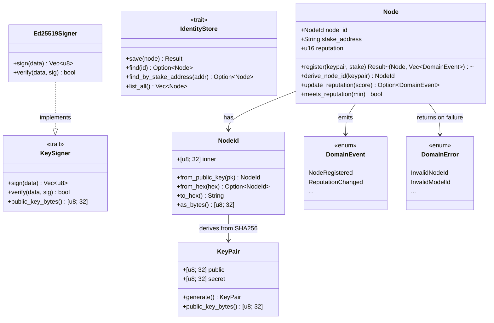
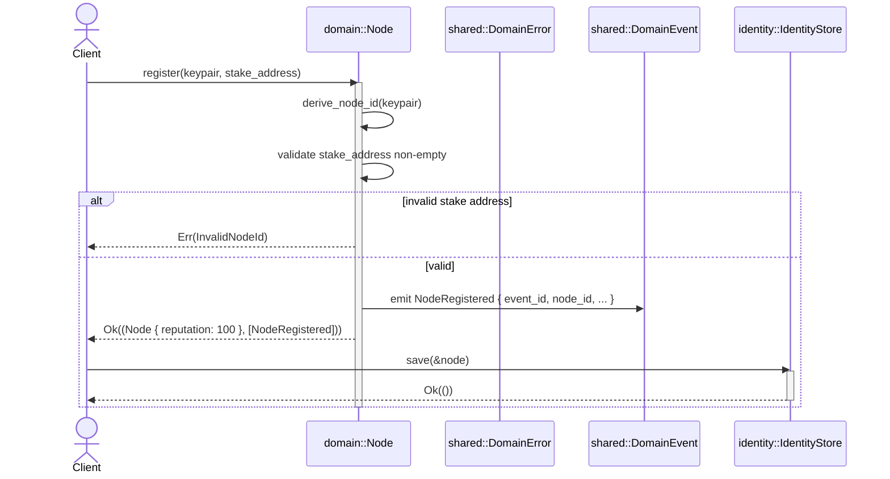

# Identity Module Architecture (Phase 1, Issue #1)

## Layered Clean Architecture (DDD)

Every module follows: **pure domain** → **application ports** → **infrastructure adapters**.
Dependencies point inward only. Infrastructure never leaks into domain.

```mermaid
flowchart LR
    subgraph Presentation["Presentation (axum)"]
        Api["api.rs — HTTP routes"]
        Middleware["middleware.rs — auth, rate-limit"]
    end

    subgraph Infrastructure["Infrastructure"]
        Ed25519["identity/infrastructure/ed25519_signer.rs"]
        Dht["dht/kademlia.rs — libp2p DHT"]
        Runtime["synapse-runtime/ — vLLM subprocess"]
        Contract["contracts/stake/StakeManager.sol"]
    end

    subgraph Ports["Application Ports (Traits)"]
        KeySigner["KeySigner — sign/verify"]
        IdentityStore["IdentityStore — save/find Node"]
        Inference["InferenceEngine — generate()"]
        StakeContract["StakeContract — stake/slash"]
    end

    subgraph Domain["Pure Domain (zero I/O)"]
        Identity["identity/ — NodeId, KeyPair, Node"]
        Model["model/ — ModelId, ExpertId, Catalog"]
        Swarm["swarm/ — Consensus, DAG, Speculative"]
        Economic["economic/ — Reputation, Pricing"]
        Shared["shared/ — DomainError, DomainEvent"]
    end

    Presentation -->|"depends on"| Domain
    Presentation -->|"uses"| Ports
    Ports -->|"implemented by"| Infrastructure
    Infrastructure -->|"depends on"| Domain
    Domain --> Domain
```



## Identity Module Structure

The identity module is the foundational aggregate: `NodeId` derives from `KeyPair`, `Node` binds them with reputation.



## File Layout

```
synapse-core/src/
├── shared/                     # DomainError + DomainEvent (cross-cutting)
│   ├── mod.rs
│   ├── domain_error.rs         # 16 variants, thiserror derives
│   └── domain_event.rs         # 7 variants, serde + uuid
├── identity/
│   ├── mod.rs                  # Re-exports: NodeId, KeyPair, Node, KeySigner, IdentityStore
│   ├── node_id.rs              # [u8; 32] newtype, SHA256 derivation, hex parsing
│   ├── key_pair.rs             # Pure domain entity (rand, no ed25519)
│   ├── node.rs                 # Aggregate: register, reputation, events
│   ├── ports.rs                # KeySigner + IdentityStore traits
│   └── infrastructure/
│       ├── mod.rs
│       └── ed25519_signer.rs   # Ed25519 adapter (only file with ed25519-dalek)
```

## Test Counts

| File | Tests | What they verify |
|---|---|---|
| `domain_error.rs` | 9 | Display format, equality, all variants |
| `domain_event.rs` | 5 | Serialization roundtrip, event uniqueness |
| `node_id.rs` | 13 | Deterministic derivation, hex parsing, display, bytes |
| `key_pair.rs` | 6 | Key generation uniqueness, equality, byte access |
| `node.rs` | 15 | Registration, reputation clamping, event emission, thresholds |
| `ports.rs` | 5 | Contract tests for both traits |
| `ed25519_signer.rs` | 7 | Sign/verify roundtrip, tamper detection, key reconstruction |
| **Total** | **60** | |

## Flow: Node Registration


